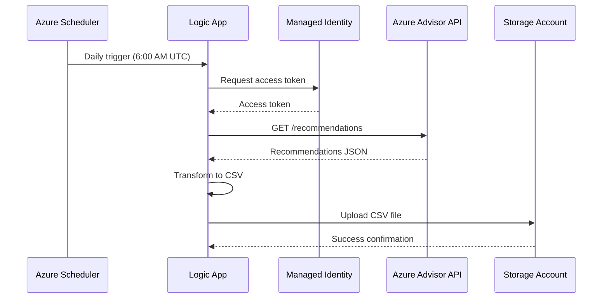

# Architecture Overview

This document provides a detailed overview of the Azure Advisor Automation solution architecture.

## High-Level Architecture

```
┌─────────────────┐    ┌─────────────────┐    ┌─────────────────┐
│                 │    │                 │    │                 │
│  Azure Advisor  │    │   Logic App     │    │ Storage Account │
│      APIs       │◄───┤   (Standard)    ├───►│   (CSV Files)   │
│                 │    │                 │    │                 │
└─────────────────┘    └─────────────────┘    └─────────────────┘
                                │
                                │
                       ┌─────────────────┐
                       │                 │
                       │ Managed Identity│
                       │ (Authentication)│
                       │                 │
                       └─────────────────┘
```

## Component Details

### 1. Azure Logic App (Standard)

**Purpose**: Orchestrates the daily collection workflow

**Key Features**:
- **Trigger**: Recurrence trigger set to daily at 6:00 AM UTC
- **Actions**: HTTP calls to Azure Advisor API, data processing, storage operations
- **Runtime**: Node.js-based with Azure Functions runtime
- **Scaling**: Automatic scaling based on workload

**Configuration**:
- **SKU**: Workflow Standard (WS1)
- **Runtime Version**: ~4
- **Node.js Version**: ~18

### 2. Managed Identity

**Purpose**: Provides secure authentication without storing credentials

**Type**: User-assigned managed identity

**Benefits**:
- No credential management required
- Automatic credential rotation
- Azure AD integrated
- Principle of least privilege

**Assigned Roles**:
- **Reader** (Subscription scope): Access to Azure Advisor APIs
- **Storage Blob Data Contributor** (Storage scope): Upload CSV files

### 3. Storage Account

**Purpose**: Stores CSV output files with Advisor recommendations

**Configuration**:
- **SKU**: Standard_LRS (configurable)
- **Account Type**: StorageV2
- **Access Tier**: Hot
- **Security**: HTTPS-only, TLS 1.2+, no public blob access

**Container Structure**:
```
advisor-recommendations/
├── advisor-recommendations-2024-01-15.csv
├── advisor-recommendations-2024-01-16.csv
└── advisor-recommendations-2024-01-17.csv
```

### 4. App Service Plan

**Purpose**: Hosts the Logic App runtime environment

**Configuration**:
- **SKU**: WS1 (Workflow Standard)
- **OS**: Windows
- **Scaling**: Elastic scaling up to 20 workers

## Data Flow

### 1. Trigger Execution


### 2. Data Processing Pipeline

1. **Initialize Variables**:
   - Current date for file naming
   - CSV header row

2. **API Call**:
   - Authenticate using managed identity
   - Call Azure Advisor REST API
   - Handle pagination (if needed)

3. **Data Transformation**:
   - Parse JSON response
   - Extract resource details from ARM resource IDs
   - Format data as CSV rows
   - Handle special characters and escaping

4. **Storage Operations**:
   - Generate unique filename with date
   - Upload to blob storage
   - Set appropriate metadata

## Security Architecture

### Authentication Flow

```
┌─────────────────┐    ┌─────────────────┐    ┌─────────────────┐
│   Logic App     │    │ Azure AD        │    │ Azure Advisor   │
│                 ├───►│ Token Endpoint  ├───►│     APIs        │
│ Managed Identity│    │                 │    │                 │
└─────────────────┘    └─────────────────┘    └─────────────────┘
```

### Network Security

- **TLS Encryption**: All communications use TLS 1.2+
- **Private Endpoints**: Can be configured for enhanced security
- **Network ACLs**: Storage account configured with secure defaults
- **CORS**: Restricted to necessary origins only

### Data Protection

- **Encryption at Rest**: Microsoft-managed keys for storage
- **Encryption in Transit**: HTTPS/TLS for all API calls
- **Access Control**: RBAC-based access to resources
- **Audit Logging**: All operations logged in Azure Activity Log

## Scalability & Performance

### Logic App Scaling

- **Automatic Scaling**: Based on queue depth and CPU usage
- **Maximum Workers**: 20 (configurable)
- **Concurrency**: 50 parallel actions (configurable)

### Performance Optimizations

1. **Parallel Processing**: Recommendations processed in parallel
2. **Chunked Transfer**: Large responses handled efficiently
3. **Connection Pooling**: Reused HTTP connections
4. **Caching**: Managed identity tokens cached

### Expected Performance

| Metric | Value |
|--------|-------|
| Recommendations Processed | Up to 10,000 per run |
| Execution Time | 5-15 minutes |
| File Size | 1-50 MB typical |
| API Rate Limits | Handled with retry logic |

## Monitoring & Observability

### Built-in Monitoring

- **Logic App Run History**: Track execution success/failure
- **Azure Monitor Metrics**: CPU, memory, execution count
- **Application Insights**: Detailed telemetry and traces

### Key Metrics to Monitor

1. **Availability**:
   - Logic App success rate
   - Failed executions
   - Average execution time

2. **Performance**:
   - API response times
   - File upload duration
   - Memory usage

3. **Business Metrics**:
   - Number of recommendations collected
   - Data freshness
   - Storage utilization

### Alerting Strategy

```yaml
Critical Alerts:
  - Logic App execution failures
  - Authentication errors
  - Storage access failures

Warning Alerts:
  - High execution duration
  - Low recommendation count
  - Storage capacity warnings
```

## Disaster Recovery

### Backup Strategy

- **Infrastructure**: All infrastructure defined in code (IaC)
- **Data**: CSV files have built-in redundancy in storage account
- **Configuration**: Logic App definitions stored in source control

### Recovery Procedures

1. **Infrastructure Failure**:
   - Redeploy using Bicep/Terraform templates
   - Restore configuration from source control

2. **Data Loss**:
   - Trigger manual execution to regenerate recent data
   - Restore from storage account backup (if configured)

3. **Regional Outage**:
   - Deploy to alternate region
   - Update DNS/routing as needed

## Cost Optimization

### Resource Right-Sizing

| Component | Development | Production |
|-----------|------------|------------|
| Logic App | WS1 | WS1-WS2 |
| Storage | LRS | GRS |
| App Service Plan | Shared | Dedicated |

### Cost Control Measures

1. **Tagging Strategy**: Comprehensive resource tagging for cost allocation
2. **Lifecycle Policies**: Automatic archival of old CSV files
3. **Monitoring**: Cost alerts and budgets
4. **Optimization**: Regular review of resource utilization

## Compliance & Governance

### Data Governance

- **Data Classification**: Business data, non-confidential
- **Retention**: Configurable retention policies
- **Access Control**: Role-based access control
- **Audit Trail**: Complete audit logging

### Compliance Features

- **Encryption**: Data encrypted at rest and in transit
- **Access Logging**: All access logged and auditable
- **Identity Management**: Azure AD integrated
- **Change Tracking**: All changes tracked in version control

## Extension Points

### Future Enhancements

1. **Data Enrichment**:
   - Cost impact calculations
   - Resource dependency mapping
   - Historical trend analysis

2. **Integration Options**:
   - Power BI connector
   - ServiceNow integration
   - Teams notifications

3. **Advanced Analytics**:
   - Machine learning recommendations
   - Predictive analytics
   - Anomaly detection

### Customization Points

- **Schedule Frequency**: Modify trigger recurrence
- **Data Filters**: Add resource group or tag filters
- **Output Formats**: Support JSON, XML, or other formats
- **Notifications**: Add email or Teams notifications